本项目是基于html5新功能及css,js实现的包含一些动画效果voxelAir网站
[效果](https://whh97.github.io/Html5_JS_VoxelAir/项目/10_开机动画.html)   

1 小功能

### 1.1 元素位置API
1. 删除某些节点时，假删除：node.display = 'none'; 一般后台也不会将数据真的删除，只是会添加一个标志位，表明该数据被删除了

2. parentNode: 指的是节点的直接父元素，与是否开启定位没有关系，和css中的包含块无关

3. js的兼容性问题：

   1. ev||event
   2. 鼠标滚轮
   3. 取消事件默认行为
   4. offsetParent: 指的是最近的包含该元素的定位元素，与css中的包含块的概念类似。
      1. 本身定位为fiexd，不管你父级有没有定位
            			火狐：offsetParent --> body
                  ie7以上、非火狐：offsetParent --> null
      2. 非fiexd
            			父级没有定位：offsetParent --> body
               		 父级有定位：offsetParent --> 定位父级

4. offsetLeft&offsetTop

   1. offsetParent不是null的情况下,是相对于offsetParent定位的,而且是相对于内边距边界定位的

   2. offsetParent是null,offsetLeft&offsetTop也是相对于body定位的

      ```
      html,body {   // 让body占满整个区域，清除系统的滚动条
      	height: 100%;
      	overflow: hidden;
      }
      ```

   3.  offsetLeft和offsetTop也是相对于自身的padding区域定位，例如b的offsetParent是a,即a的padding区域到b的padding区域的距离，包含a的padding,不包含b的padding

   4. 获取元素在视口的位置

      1. 绝对位置：到body的距离

         1. 在存在滚动条的情况下，body会跟随页面的滑动而滑动

         2. ```
            获取元素的绝对位置：
            
            function getPointAb(node){
            	let x = 0,y=0;
            	while(node){
            		x += node.offsetLeft;
            		y += node.offsetTop;
            		node = node.offsetParent;
            	}
            	return {x,y};
            }
            
            默认：body.offsetParent=null
            	body.offsetTop=0
            	body.offsetLeft=0
            ```
            
         3. 例如：a包含b,b包含c,a、b均开启了定位，则c.offsetLeft只是获得了c相对于b的偏移量，还需要添加b相对于a的偏移量，a相对于body的偏移量，这样就可以得到c的绝对位置：`c的绝对位置=c.offsetLeft+b.offsetLeft+a.offsetLeft+body.offsetLeft`

         4. 它存在一个问题：offsetLeft和offsetTop在遇到border时会直接忽略掉，不会考虑进去

            ```
            <style>
              * {
                margin: 0;
                padding: 0;
              }
              #inner2 {
                border: 10px solid purple;
                width: 100px;
                height: 100px;
                position: absolute;
                background-color: #bfa;
                top: 100px;
                left: 100px;
              }
              #inner1 {
                margin: 10px;
                width: 100px;
                height: 100px;
                background-color: red;
              }
              #wrap {
                border: 50px solid pink;
                width: 300px;
                height: 300px;
                position: absolute;
                background-color: yellow;
              }
            </style>
            
            <body id="body">
                body
                <div id="wrap">
                  wrap
                  <div id="inner1">
                    inner1
                    <div id="inner2">inner2</div>
                  </div>
                </div>
            </body>
            
            <script>
                window.onload = function () {
                  // parentNode是直接父亲，与开不开启定位没有关系
                  const inner2 = document.querySelector("#inner2");
                  console.log(getPointAb(inner2));   // {200,221}
                  function getPointAb(node) {
                    let x = 0,
                      y = 0;
                    while (node) {
                      x += node.offsetLeft;
                      y += node.offsetTop;
                      node = node.offsetParent;
                    }
                    return { x, y };
                  }
                };
              </script>
            ```

            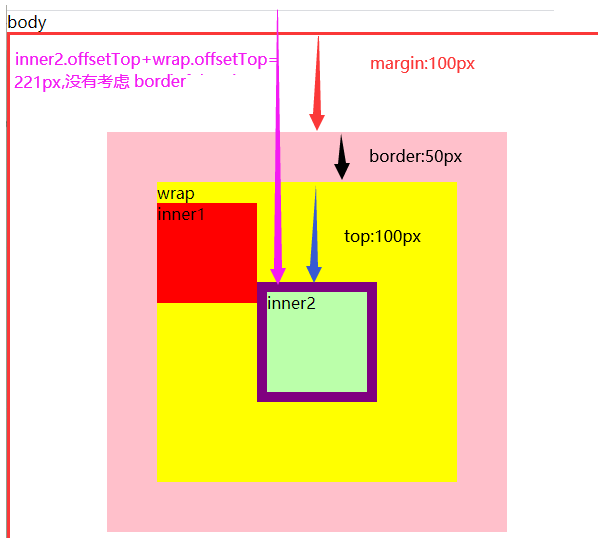

      2. 相对位置：到视口的距离
         1. 相对距离 = 页面的绝对距离 - 滚动条滚动的距离

         2. 这里可以用于图片的懒加载，判断图片到相对距离在一定范围后，加载该图片

         3. 滚动条滚动的距离(实际上是滚动条滚动时元素滚动的距离，页面上滑的高度)：document.documentElement.scrollTop || document.body.scrollTop

         4. ```
            获取元素的相对位置： 依然存在border不被算进去的问题
            
            function getPointAb(node){
            	let x = 0,y=0;
            	while(node){
            		x += node.offsetLeft;
            		y += node.offsetTop;
            		node = node.offsetParent;
            	}
            	let L = document.documentElement.scrollLeft || document.body.scrollLeft;
            	let T = document.documentElement.scrollTop || document.body.scrollTop;
            	return {x:x-L,y:y-T};
            }
            ```

         5. 一个直接获取元素相对位置的api，可以解决border不被算进去的问题

            ```
            element.getBoundingClientRect()
                返回一个对象，该对象具备6个属性，top,bottom,right,left均是相对于视口的，height,width
                right和bottom比较特别，right指的是元素右边到视口左侧的距离，bottom是元素下边到视口上边的距离
                ie8及以下只具备left,right,top,bottom属性，ie9及以上具备了width和height属性
                
                
            以此计算绝对位置：element.getBoundingClientRect().left + 滚动条滚动的距离 = 元素的绝对位置
            ```

5. clientHeight&clientWidth    offsetHeight& offsetWidth

   1. clientHeight&clientWidth
      1. 获取的是元素的可视区域(padding box)的高度和宽度,即拿到的是padding+width、padding+height
   2. offsetHeight& offsetWidth
      1. 获取的是：border box ,即拿到的是border+width+padding

6. 获取视口的尺寸

   1. ```
      // 根标签的clientWidth、clientHeight的作用与一般的clientWidth、clientHeight的作用不同
      // 它并不是根标签的可视区域，它就代表视口的大小
      // 就算为html添加了margin,border等，它还是会获取到border box的尺寸
      var w = document.documentElement.clientWidth;
      var h = document.documentElement.clientHeight;
      ```

   2. 注意：在ie10及ie10以下，根标签的clientWidth和offsetWidth统一被指定为视口的宽度，即均可以用于获取视口的宽度

   3. 所以无论什么浏览器，直接使用1.中的方法获取视口尺寸即可

#### scrollHeight,scrollWidth   

https://blog.csdn.net/nic7968/article/details/7217823

情况1：自身有宽高，有padding

1. IE 6和IE 7: 左内边距 + 右内边距  不加宽高

2. 其他浏览器：左内边距 + 自身宽高 + 右内边距

情况2：没有滚动条，有内容

1. 所有浏览器：scrollWidth = 左内边距 + 内容宽度 + 右内边距

情况3：有滚动条，有内容

1. IE 6和IE 7:  scrollWidth = 左内边距 + 内容宽度 + 右内边距

2. 其他浏览器：scrollWidth = 左内边距 + 内容宽度

#### 1.1.1 mac停靠栏

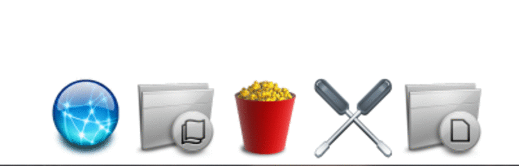

原理：当鼠标移动到某个图片的一个半径范围内后，该图片就会逐渐放大(修改图片的尺寸)

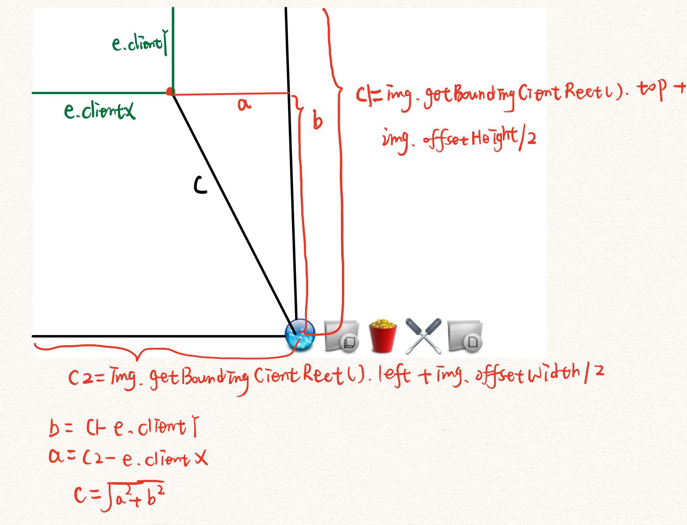

```
<!DOCTYPE html>
<html lang="en">
  <head>
    <meta charset="UTF-8" />
    <meta name="viewport" content="width=device-width, initial-scale=1.0" />
    <title>mac停靠栏</title>
    <style>
      * {
        margin: 0;
        padding: 0;
      }
      /* 清除默认的滚动条 */
      html,
      body {
        height: 100%;
        overflow: hidden;
      }
      #wrap {
        /* 水平居中 */
        position: absolute; /*元素不再默认占据100%*/
        bottom: 0;
        left: 0;
        right: 0;
        width: 100%;
        text-align: center;
      }
      #wrap img {
        width: 64px;
      }
    </style>
  </head>
  <body>
    <div id="wrap">
      
      
      
      
      
    </div>
    <script>
      window.onload = function () {
        var imgs = document.querySelectorAll("#wrap img");
        // 确定变化的半径
        var r = 320;
        document.onmousemove = function (e) {
          e = e || event;
          for (var i = 0; i < imgs.length; i++) {
            let a =
              imgs[i].getBoundingClientRect().left +
              imgs[i].offsetWidth / 2 -
              e.clientX;
            let b =
              imgs[i].getBoundingClientRect().top +
              imgs[i].offsetHeight / 2 -
              e.clientY;
            let c = Math.sqrt(a * a + b * b);
            if (c >= r) {
              // 控制图片的宽度增大
              c = r;
            }
            // 图片原本的尺寸是128px,  0.2的确定：主要保证页面初始化后，图片的尺寸依旧为64px
            // 随着鼠标的靠近，元素尺寸逐渐变大为128px
            imgs[i].style.width = 128 - c * 0.2 + "px";
          }
        };
      };
    </script>
  </body>
</html>
```

### 1.2 滚轮事件

1. 鼠标滚轮：

   非火狐浏览器: onmousewheel

   火狐: addEventListener('DOMMouseScroll',callback)

   ```
   // 火狐
   if(node.addEventListener){
   	node.addEventListener('DOMMouseScroll',callback);
   }
   // 非火狐
   node.onmousewheel = function(){}
   ```

2. 滚轮方向

   非火狐：event.wheelDelta   向下负值，向上正值

   火狐：event.detail    向下正值，向上负值

   ```
   var dir = '';
   if(event.wheelDelta){
   	dir = event.wheelDelta>0 :'up':'down';
   }else{
   	dir = event.detail>0 :'down':'up';
   }
   if(dir==='up'){
   	node.style.height = node.offsetHeight - '10' + 'px';
   }else{
   	node.style.height = node.offsetHeight + '10' + 'px';
   }
   ```

   注意：如果存在滚动条，则需要阻止事件的默认行为

   ```
   非火狐(IE8+)：return false;
   火狐：event.preventDefault();
   
   if(event.preventDefault){
   	event.preventDefault();
   }
   return false;
   ```
### 1.3 曲线运动

前提知识：

	---勾股定理
				a*a + b*b =c*c
	---三角函数
		正弦 : sin
		余弦 : cos
		正切 : tan
		余切 : cot
		正弦定理
			a/sinA = b/sinB =c/sinC = 2r（r为外接圆半径）
		余弦定理
			cosA = b*b + c*c - a*a / 2bc
			cosB = c*c + a*a - b*b / 2ca
			cosC = a*a + b*b - c*c / 2ab
			
	---什么是弧度	
		一个角度到底代表多少弧度：这个角度所包含的外接圆的弧长/外接圆的半径
		
		360 角度 = 2*PI*r/r 弧度(360角度  = 2*PI 弧度)   		
			===> （单位换算）
				1角度 = PI/180  弧度 
				1弧度 = 180/PI 角度
			
	---角度转弧度				弧度转角度
		弧度值 = 角度值*PI/180			角度值 = 弧度值*180/PI
	
	---三角函数图像
		曲线运动
		
	---完成曲线运动
	
	---与canvas结合
		人眼能接收的最好频率为一秒钟60次,这样的体验是比较好的

#### 1.3.1 正弦曲线运动

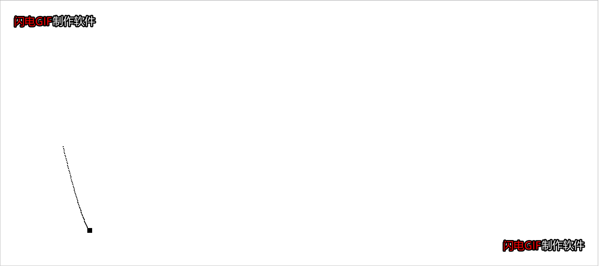

原理：

1. 元素的left属性设置为sin曲线的角度变化，每60ms增加一次角度，元素的top属性设置为sin曲线的y轴变化
2. 每一次left和top变化，都产生一个新的元素（不用清除画布，保留之前画的点，实质上就是很多点连接起来的），将left和top设置为该值。（提前定义好样式，使用类样式直接添加)
3. 实际上用canvas做更方便，之前lineTo()对应的left和top值即可

```
<!DOCTYPE html>
<html>
	<head>
		<meta charset="UTF-8">
		<title></title>
		<style type="text/css">
			*{
				margin: 0;
				padding: 0;
			}
			#test{
				position: absolute;
				left: 200px;
				top: 300px;
				width: 10px;
				height: 10px;
				background: black;
			}
			
			.box{
				position: absolute;
				border: 1px solid;
			}
		</style>
	</head>
	<body>
		<div id="test"></div>
	</body>
	<script type="text/javascript">
		
		window.onload=function(){
			var testNode = document.querySelector("#test");
			var startX = testNode.offsetLeft;
			var startY = testNode.offsetTop;
			//角度
			var deg =0;
			var step = 100;
			
			
			setInterval(function(){
				deg++;
				
				testNode.style.left = startX + (deg*Math.PI/180)*step/2 +'px';
				testNode.style.top = startY + Math.sin( deg*Math.PI/180 )*step*2+"px";
				
				var boxNode = document.createElement("div");
				boxNode.classList.add("box");
				boxNode.style.left=testNode.offsetLeft+"px";
				boxNode.style.top=testNode.offsetTop+"px";
				document.body.appendChild(boxNode);
				
			},1000/60)
		}
		
		
	</script>
</html>

使用canvas实现：
<script>
      window.onload = function () {
        var canvas = document.getElementById("test");
        let deg = 0;
        if (canvas.getContext) {
          var ctx = canvas.getContext("2d");
          ctx.translate(0, 150);
          step = 100;
          setInterval(function () {
            deg++;
            ctx.lineTo(
              (((deg * Math.PI) / 180) * step) / 5,
              Math.sin((deg * Math.PI) / 180) * step
            );
            ctx.stroke();
          }, 1000 / 60);
        }
      };
    </script>
```

#### 1.3.2 气泡1

实现下面的效果：

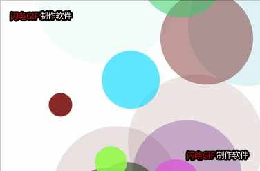		
核心：

1.  开启一个延时器，产生很多圆心位置随机、颜色随机的圆保存在一个数组中
2. 每60ms对数组中产生的圆进行绘制，注意：圆的半径是逐渐增大的，圆的透明度也是逐渐减小的，需要设置
3. 删除数组中非必要保存元素，对于透明度小于0的元素直接删除即可，因为每100ms都会产生一个新的圆

```
<!DOCTYPE html>
<html lang="en">
  <head>
    <meta charset="UTF-8" />
    <meta name="viewport" content="width=device-width, initial-scale=1.0" />
    <title>Document</title>
    <style>
      * {
        margin: 0;
        padding: 0;
      }
      body {
        background-color: pink;
      }
      canvas {
        position: absolute;
        left: 0;
        right: 0;
        top: 0;
        bottom: 0;
        margin: auto;
        background-color: white;
      }
    </style>
  </head>
  <body>
    <canvas width="400px" height="400px"></canvas>
    <script>
      window.onload = function () {
        var oc = document.querySelector("canvas");
        if (oc.getContext) {
          var ctx = oc.getContext("2d");

          // 保存圆的信息
          var arr = [];
          setInterval(function () {
            var x = Math.random() * oc.width;
            var y = Math.random() * oc.height;
            var r = 10;
            var red = Math.random() * 255;
            var green = Math.random() * 255;
            var blue = Math.random() * 255;
            var alpa = 1;
            arr.push({ x, y, r, red, green, blue, alpa });
          }, 100);

          // 每60ms检测一次，画圆
          setInterval(function () {
            //   清除上一次的画布
            ctx.clearRect(0, 0, oc.width, oc.height);

            // 增大圆的半径，改变圆的透明度
            for (let i = 0; i < arr.length; i++) {
              // 如果元素的透明度小于0，则直接删掉该元素
              if (arr[i].alpa <= 0) {
                arr.splice(i, 1);
              }
              arr[i].r++;
              arr[i].alpa -= 0.01;
            }

            //   将数组中的圆绘制到画布上
            arr.forEach((item) => {
              // 画圆
              ctx.save();
              ctx.fillStyle = `rgba(${item.red}, ${item.green}, ${item.blue}, ${item.alpa})`;
              ctx.beginPath();
              ctx.arc(item.x, item.y, item.r, 0, (360 * Math.PI) / 180);
              ctx.fill();
              ctx.restore();
            });
          }, 1000 / 60);
        }
      };
    </script>
  </body>
</html>
```

#### 1.3.3 气泡2

实现的效果：

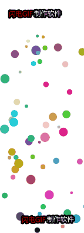

原理：

1. 在气泡1的基础上，首先圆的大小、透明度不需要发生变化了，可以将那部分代码删除
2. 需要为添加曲线运动，设置曲线运动的起点，即需要修改每一个圆的y,由于canvas的正坐标轴向下，所以圆在cavas底部产生，y应该等于oc.height-r
3. 圆在做曲线运动时，y轴表示角度，x轴表示sin(角度)。从canvas底部运动到canvas顶部，需要设置运动的角度deg、圆心的运动位置startX,startY。另外圆从canvas底部运动到canvas顶部，y值不断减小，所以应该使用startY-角度的值。
4. step:控制曲线上和左右摆动的幅度。

```
<!DOCTYPE html>
<html lang="en">
  <head>
    <meta charset="UTF-8" />
    <meta name="viewport" content="width=device-width, initial-scale=1.0" />
    <title>Document</title>
    <style>
      * {
        margin: 0;
        padding: 0;
      }
      body {
        background-color: pink;
      }
      canvas {
        position: absolute;
        left: 0;
        right: 0;
        top: 0;
        bottom: 0;
        margin: auto;
        background-color: white;
      }
    </style>
  </head>
  <body>
    <canvas width="150px" height="400px"></canvas>
    <script>
      window.onload = function () {
        var oc = document.querySelector("canvas");
        if (oc.getContext) {
          var ctx = oc.getContext("2d");

          // 保存圆的信息
          var arr = [];
          setInterval(function () {
            console.log(arr);
            var x = Math.random() * oc.width; // 圆心
            var r = Math.random() * 6 + 2;
            var y = oc.height - r; // 圆的半径
            var red = Math.random() * 255; // 控制圆的颜色
            var green = Math.random() * 255;
            var blue = Math.random() * 255;
            var alpa = 1; // 控制圆的透明度

            var deg = 0; //控制sin函数的角度变化，即圆的高度移动
            var startX = x; // 控制圆的运动圆心位置
            var startY = y;
            var step = Math.random() * 10 + 10; // 控制曲线的运动形式
            arr.push({
              x,
              y,
              r,
              red,
              green,
              blue,
              alpa,
              deg,
              startX,
              startY,
              step,
            });
          }, 50); // 每50ms就产生一个随机圆

          // 每60s检测一次，
          setInterval(function () {
            //   清除上一次的画布
            ctx.clearRect(0, 0, oc.width, oc.height);

            // 添加圆的曲线运动
            for (let i = 0; i < arr.length; i++) {
              arr[i].deg += 8; // 增大度数的变化速度
              // 控制圆心的运动位置
              arr[i].x =
                arr[i].startX +
                Math.sin((arr[i].deg * Math.PI) / 180) * arr[i].step * 2;

              // 这里要减：这样气泡才会往上跑
              arr[i].y =
                arr[i].startY - ((arr[i].deg * Math.PI) / 180) * arr[i].step;

              // 如果气泡到了距离顶部50处，则从数组中清除掉，控制arr中元素的数量
              if (arr[i].y <= 50) {
                arr.splice(i, 1);
              }
            }

            //   将数组中的圆绘制到画布上
            arr.forEach((item) => {
              // 画圆
              ctx.save();
              ctx.fillStyle = `rgba(${item.red}, ${item.green}, ${item.blue}, ${item.alpa})`;
              ctx.beginPath();
              ctx.arc(item.x, item.y, item.r, 0, (360 * Math.PI) / 180);
              ctx.fill();
              ctx.restore();
            });
          }, 1000 / 60); // 每1000/60ms就画一次圆
        }
      };
    </script>
  </body>
</html>
```

## 2 项目

### 2.1 样式初始化

1. 首先需要重置一些样式，规范不同浏览器的自定义样式

   ```
   /*css reset 开始*/
   html,
   body {
     // 禁止滚动条
     height: 100%;
     overflow: hidden; 
   }
   html,body,h1,h2,h3,h4,h5,h6,p,ul,li {
     margin: 0px;
     padding: 0px;
     font: 14px "微软雅黑";
   }
   a {
     text-decoration: none;
     display: block;
   }
   li {
     list-style: none;
   }
   img {
     display: block;
   }
   /*css reset 结束*/
   ```

2. 对于常用的清除浮动的样式clearfix等可以单独提取出来，方便后面为某个标签添加

   ```
   .clearfix {
     *zoom: 1;   // 兼容IE6
   }
   .clearfix:after {   
     content: "";
     display: block;
     clear: both;
   }
   ```

3. 为每一个块的样式添加一个块注释

### 2.1 项目头部

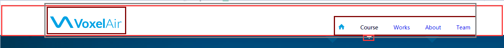

分析：

1. 首先头部head中包含一个主体块headerMain,旁边两块是留白，采用流体布局包固定布局的格式。headMain的参数为：

   ```
   主体内容宽度:1100px
   头部高度:80px
   logo margintop:30px
   nav  margintop:50px
   nav中li marginleft:40px
   箭头: 21px(宽);11px(高)
   ```

2. headerMain中包含三个部分：logo,nav和narrow(小箭头)，logo左浮动，nav右浮动，小箭头需要绝对定位。很明显，logo左浮动，nav右浮动。nav中li需要左浮动或者inline-block,**注意：inline-block元素之间会存在空隙，这是由于字体大小+html中的空格导致的**，所以这里用左浮动最好。

3. 鼠标悬浮在每一个li上时，都会存在一个过渡效果，其实是每一个li中包含两个div块：up和down，两者的字体颜色不同，过渡效果其实就是先隐藏其中一个，hover时再展示，添加一个transition时间。up开启了绝对定位，down就会移动到up的下方。为了只显示down，将up的宽度置为0，overflow:hidden。这样在首屏加载的时候，就会先显示down。当鼠标悬浮时，就为up添加过渡效果。当鼠标悬浮在li上时，再设置其width:100%,从而展示出up,出现过渡效果。

   **注意：用宽度做动画存在局限性，但也可以修改。**这里使用宽度作为过渡效果，则当鼠标悬浮时，一定是从左向右变化的，鼠标离开后一定是从右往左变化的，因为宽度的增加和减小是以左侧为基准的。同理高度增加就可以实现从上到下变化的效果。如果要实现悬浮时从右向左、从下到上的变化则需要修改参考点，则可以考虑：

   ```
   div {
   	width:100px;
   	height:100px;
   	position:absolute;
   	bottom:100px;
   	right:100px;
   }
   使用bottom和right设置位置后，则参考点就变成了div右下角，则宽度增加就会实现从右向左的效果。高度增加就会实现从下到上的过渡效果。
   ```

4. 箭头的位置：箭头是相对于headerMain定位的，在css中为其设置初始的left为50%，然后需要通过js调整其left，使其位于对应li的正下方。

   ```
   // 获取dom元素
   var arrowEle = document.querySelector("#head .headMain .arrow");
   var liNodes = document.querySelectorAll(
     "#head .headMain .nav .list li"
   );
   var upNodes = document.querySelectorAll(
     "#head .headMain .nav .list li .up"
   );
   var firstLiNode = liNodes[0];
   
   // 设置箭头位置
   arrowEle.style.left =
     firstLiNode.offsetLeft +
     firstLiNode.offsetWidth / 2 -
     arrowEle.offsetWidth / 2 +
     "px";
   ```

5. 另外，第一个li默认up是展示的，所以需要在js中设置它的up的宽度是100%的。**注意：这个样式是通过js直接设置的，所以后面如果需要修改，则也需要通过js才能修改，通过css的样式是不能达到修改的效果**

   ```
   // 第一个li默认显示up,所以页面初加载时会有一个过渡的效果的展示
   var firstUpNode = firstLiNode.querySelector(".up");
   firstUpNode.style.width = "100%";
   ```

6. 点击每一个li时，展示对应的up,其余up隐藏。这里存在一个问题：**需要在js中修改元素的样式，这会产生内联样式，内联样式的优先级高于css样式，所以一旦在这里将样式写死，则会导致后面css中样式的修改不起作用，所以一般将样式设置为空值"",这样不会产生内联样式。**另外，点击li，小箭头会自动跳转到该li的正下方，需要修改小箭头的位置。

   ```
   // 点击每一个li，箭头就移动到对应li的正下方，并且该li的up展示
   for (let i = 0; i < liNodes.length; i++) {
     liNodes[i].onclick = function (event) {
       // 将所有的up均隐藏
       for (let j = 0; j < upNodes.length; j++) {
         // special One
         // 这里如果设置为0则会为其绑定内联样式，导致css无法对其产生修改
         // 设置为""则不会为其添加内联样式
         upNodes[j].style.width = "";
       }
       // 将当前点击的li对应的up展示
       upNodes[i].style.width = "100%";
       // 修改箭头的位置
       arrowEle.style.left =
         liNodes[i].offsetLeft +
         liNodes[i].offsetWidth / 2 -
         arrowEle.offsetWidth / 2 +
         "px";
     };
   }
   ```

### 2.2 内容区

1. 布局：
   1. 内容区content包含很多个分屏，每次点击某个nav,就会滑动出现其对应的分屏。
   
   2. 内容区的的高度是通过js动态控制的，它就等于视口高度-header高度。之所以选择使用js控制，因为每次缩小窗口时，像素大小会变小，屏幕中的像素数量会变多，整个head区域的像素数量不变，从而需要调整content区域的像素数量，使得head+content区域的像素数量占满整个屏幕的像素数量。如下，左边是屏幕缩小之前，右边是屏幕缩小之后，content区域的背景是灰色。**只要是与视口大小相关的属性的值的修改表达式，都需要在onresize函数中执行，这样保证每一次视口修改都能实现其他样式的修改**
   
      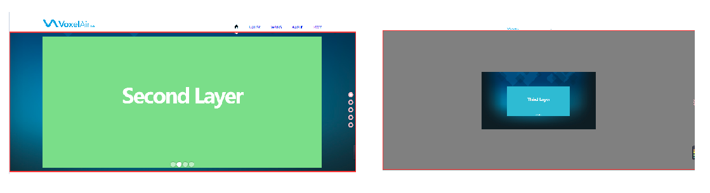

   3. 内容区内包含一个流布局list,list的宽高和content相同。list中包含5个li(home,course,works,about,team)的流布局，每个li中又包含1个固定布局section，固定布局的参数:
   
      ```
      1100 * 520
      ```
   
      即：基本上每一个大的块区域都使用：1个流布局+1个固定布局的形式
   
   4. background的背景偏移百分比的参照关系：参照于背景区域的尺寸—>背景图的尺寸
      1. 百分比就是去计算背景图片的偏移量的
      
   5. 
   
2. 交互
   
   1. 内容区过渡：多个li是竖着放置在list中的，每次点击某个nav,实际上是通过修改ul的top值实现的，每次点击某个nav,则对应将ul的top值修改为对应的值。因为每个li的高度，也就是content的高度是由js控制的，所以每次上移的高度也由js控制。比如，在刚初始化时，top应该为0，点击第i个nav时，top的值等于-i*(视口高度-head高度)。 在css样式中需要为top属性设置过渡效果。
   
   2. 调整分辨率时：
      1. 视口只能出现一屏，需要通过resize重新调整；
      2. 每一屏的偏移量需要重新调整。否则每次点击到某一屏，再进行缩放，则会出现多屏的情况，因为此时页面中的像素变小变多了，和缩放之前的像素不同。需要在resize中调整
   
   3. 滚轮实现内容区切换
      1. 首先需要考虑滚轮事件的兼容性：**onmousewheel**、DOMMouseScroll、wheelDelta、detail
   
      2. 考虑当多次滑动滚轮时，会触发多次回调，则可以通过防抖处理
   
         ```
         let timeId;
         var now = 0;   //当前屏的索引
         
         // 滚轮切换内容区
         if (content.addEventListener) {
           content.addEventListener("DOMMouseScroll", function (e) {
             e = e || event;
             // 防抖动
             if (timeId) {
               clearTimeout(timeId);
             }
             // 只有最近一次的滑动会被执行
             timeId = setTimeout(function () {
               fn(e);
             }, 200);
           });
         }
         content.onmousewheel = function (e) {
           e = e || event;
           // 防抖动
           if (timeId) {
             clearTimeout(timeId);
           }
           // 只有最近一次的滑动会被执行
           timeId = setTimeout(function () {
             fn(e);
           }, 200);
         };
         function fn(e) {
           let direction = "";
           e = e || event;
           if (e.wheelDelta) {
             direction = e.wheelDelta > 0 ? "up" : "down";
           } else if (e.detail) {
             direction = e.detail < 0 ? "up" : "down";
           }
           switch (direction) {
             case "up":
               if (now > 0) {
                 now--;
                 move(now);
               }
         
               break;
             case "down":
               if (now < cliNodes.length - 1) {
                 now++;
                 move(now);
               }
               break;
           }
           // 多次不松手滑动鼠标滚轮只响应一次 防抖节流
         }
         ```
   
   4. move函数的抽取

### 2.3 第三屏

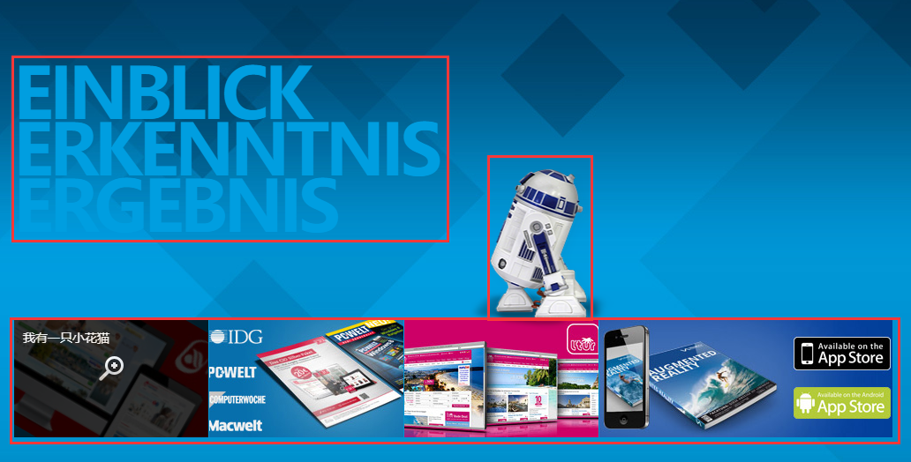

分析：

1. 第三屏主要分为三个部分，work1部分的文字，work2部分的图片，work3的机器人动画

2. work1：主要是要设计字体的样式

   1. 这里需要注意的是，注意提取共同样式。因为好几屏中都用到了类似于work1的块，所以可以将文字的样式提取为一个共同的类样式commonTitle。
   2. 然后设置margin即可
   3. work1有一点要注意：伪类的使用 last-child

3. work2需要注意的地方有点多：   感觉html的设计比较重要，就是标签如何放置

   1. work2内部4个块，每个块中包含一张图片和一个隐藏层，当鼠标放置在该块上时，会显示该隐藏层，所以每个div块又包含两个部分

      ```
      <div class="works2">
          <div class="item">
            
            // 隐藏层
            <div class="mask">
              <span>我有一只小花猫</span>
              <div class="icon"></div>
            </div>
          </div>
          <div class="item">
            
            <div class="mask">
              <span>我有一只小花狗</span>
              <div class="icon"></div>
            </div>
          </div>
      </div>
      ```

   2. 在设置mask宽高时，使用了一个等式方法：为了满足等式，则会自动将mask宽高设置为父元素宽高的100%

      ```
      position: absolute;
        left: 0;
        right: 0;
        top: 0;
        bottom: 0;
      ```

   3. 但是注意一点：mask在最开始时透明度为0，当鼠标悬浮在item上时才会显示mask,并且显示的过程需要添加过渡效果

      1. mask中存在图标字体，当鼠标在图标字体悬浮时，也需要通过修改background-position修改图标字体，并且修改的过程需要添加过渡效果

   4. 当鼠标悬浮在item上时需要为img添加旋转和缩放效果，旋转和缩放的过程也需要添加过渡效果。

4. work3机器人

   1. 首先通过定位确定机器人的初始位置，机器人是通过背景图片来设置的

   2. 然后开启动画，这里主要需要熟悉动画的设置操作

      ```
      .work3{
      	animation: work3Move 4s linear infinite;
      }
      
      @keyframes work3Move {
        // 百分比代表的是时间的百分比，即从0-4*0.49s时，只平移不旋转
        // 从4*0.49-2s 平移加旋转
        0% {
          transform: translateX(0px) rotateY(0deg);
        }
        49% {
          // 保证在机器人走到左边的过程中不是逐渐转身的
          transform: translateX(-490px) rotateY(0deg);
        }
        50% {
          // 从49%-50%实现机器人的转身，翻转是即时的
          transform: translateX(-500px) rotateY(180deg);
        }
        100% {
          transform: translateX(0px) rotateY(180deg);
        }
      }
      ```

### 2.4 第二屏

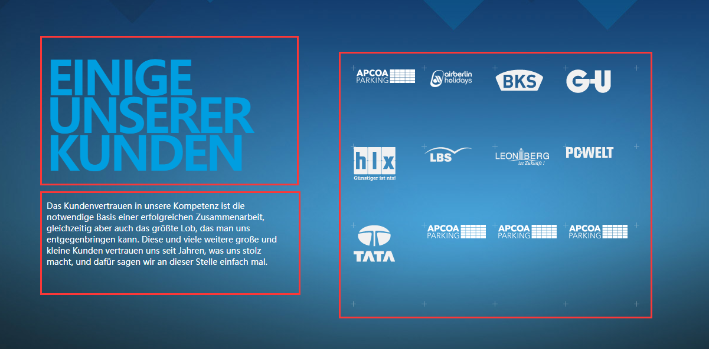

分析：

1. 第二屏主要包含三个部分：与第一屏类似的course1,文字区域course2以及照片墙course3

2. course1: 这部分直接为其添加第二屏中写的类样式，然后设置margin调整位置即可

3. course2: 这部分因为其他界面也存在相同的块，所以为文本单独设置一个共同的类样式，添加，然后设置width和margin调整位置即可

4. course3: 

   1. 首先很明显照片墙中包含16张图片，肯定是12个li或者div块实现，但是还注意到在照片墙中包含一些加号，每一列其实是一个背景图片，考虑使用5个span，采用绝对定位的方式根据每个li的宽度设置每个span的位置。
   2. 每个照片其实还存在动画效果：刚加载是展示的就是照片，当鼠标悬浮在每个li上时，可以发现图片沿着y轴旋转了180度，在图片的背后的另外的东西旋转出来了。

   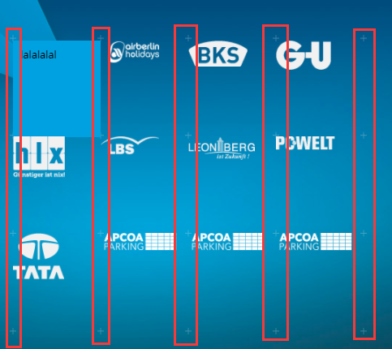

   1. 首先依然要学习元素的布局，布局时的想法等。

      ```
      <div class="course3">
          <span class="line"></span>
          <span class="line"></span>
          <span class="line"></span>
          <span class="line"></span>
          <span class="line"></span>
          <div class="item">
            <div class="backface"></div>
            <div class="face">lalalalal</div>
          </div>
          <div class="item">
            <div class="backface"></div>
            <div class="face">lalalalal</div>
          </div>
          // 12ge
      </div>
      ```

   2. 确定course3的位置：宽度一定，480px，为其开启定位，参照于其父元素course。course3中放置了12个item,为了实现上面的效果需要为每个item设置浮动。

   4. course3中的动画效果：

      1. 将鼠标放置在某个图片上时，图片会旋转180度，显示其背后的内容。所以考虑在face中放置字，backface中存放一个背景图片。为face和backface同时开启绝对定位，这样face中的文字会直接展示在backface的背景上。**这里就可以解释为什么将backface放在了face之前，就是为了保证face中的字不被backface的背景图片盖住**

      2. 动画效果的原理：face有文字   backface有背景图片

         1. 首先将face沿着y轴旋转180度，从而展示出face的背面。**`backface-visibility: hidden;`表示隐藏被旋转div块的背面**，这样我们就只能看到backface的背景图片了。

         2. 然后当鼠标悬浮在item上时将face和backface同时旋转180度，则face就总共旋转了360度，相当于没有旋转，就显示出文字了

         3. 为了展示出3维效果，需要加景深和3D效果，为item添加

            ```
            item{
            	/* 景深和3D */
              perspective: 500px;
              transform-style: preserve-3d;
            }
            ```

5. 注意nth-child和nth-of-type的用法区别，nth-child有坑

   ```
   p:nth-child(n):寻找p的直接父节点下第n个元素，如果该元素是p，则为其添加样式，如果不是p则不加样式
   
   p:nth-of-type(n): 寻找p的直接父节点下的第n个p元素，即使有其他元素的存在，也不影响
   ```

   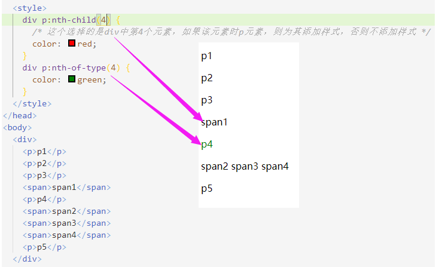

### 2.5 第一屏 

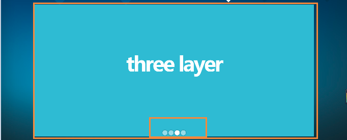

1. 布局

   1. 首先第一屏总共可以分为2个部分，一个放轮播图，一个放小圆点图标，两个ul

      ```
      <li class="home">
          <section>
            <ul class="home1">
              <li class="commonTitle"><div class="item">First Layer</div></li>
              <li class="commonTitle">
                <div class="item">Second Layer</div>
              </li>
              <li class="commonTitle"><div class="item">Third Layer</div></li>
              <li class="commonTitle">
                <div class="item">Fourth Layer</div>
              </li>
            </ul>
            <ul class="home2">
              <li></li>
              <li></li>
              <li></li>
              <li></li>
            </ul>
          </section>
      </li>
      ```

   2. **开启定位的元素会从块->行内元素**，从而宽高由内容撑开。如果定位元素需要继承父元素，则直接令

      ```
      posiition:absolute;
      left:0;
      right:0;
      top:0;
      bottom:0;
      ```

      根据等式准则，就相当于将width和height设置为了auto,为了满足等式，则会直接将宽高设置为父元素的宽高

      在此基础上如果需要使得内部的(inline,inline-block)元素水平居中，则直接text-align:center即可。

2. 3D效果

   1. 给home1设置景深，`perspective:1000px; transform:preserve-3D`，这样才会出3D效果。

   2. display不是一个可动画的属性，visibility才是。并不是每个属性都可以动画。

   3. 首先，所有的页面都需要隐藏起来，类名为active的li显示。然后需要创建四个动画，对应四个类样式，哪个页面需要就为哪个页面添加

   4. 两个页面切换，两个形式：

      1. 左隐藏右显示：需要两个动画leftHide,rightShow

         ```
         #content > .list > .home .home1 > li.leftHide {
           visibility: hidden;
           animation: 1s leftHide 1 linear;
         }
         #content > .list > .home .home1 > li.rightShow {
           visibility: visible;
           animation: 1s rightShow 1 linear;
         }
         左隐藏：刚开始是显示的，动画结束后就消失
         @keyframes leftHide {
           0% {
             visibility: visible;
           }
           50% {
             // 左移元素宽度的40%，沿着y轴旋转30度，整体缩小为原图大小的80%
             // 旋转的中心就是center center,沿着y轴旋转30度，则就是右侧先进入
             transform: translateX(-40%) rotateY(30deg) scale(0.8);
           }
           100% {
             // 向屏幕内部平移200px,最后消失
             transform: translateZ(-200px);
             visibility: hidden;
           }
         }
         
         右显示：刚开始是隐藏的，动画结束后显示
         @keyframes rightShow {
         0% {
             visibility: hidden;
             transform: translateZ(-200px);
           }
           50% {
             transform: translateX(40%) rotateY(-30deg) scale(0.8);
           }
           100% {
             visibility: visible;
           }
         }
         ```

      2. 左显示右隐藏：需要两个动画leftShow,rightHide

         ```
         #content > .list > .home .home1 > li.rightHide {
           visibility: hidden;
           animation: 1s rightHide 1 linear;
         }
         #content > .list > .home .home1 > li.leftShow {
           visibility: visible;
           animation: 1s leftShow 1 linear;
         }
         @keyframes rightHide {
           0% {
             visibility: visible;
           }
           50% {
             transform: translateX(40%) rotateY(-30deg) scale(0.8);
           }
           100% {
             transform: translateZ(-200px);
           }
         }
         
         @keyframes leftShow {
           0% {
             visibility: hidden;
             transform: translateZ(-200px);
           }
           50% {
             transform: translateX(-40%) rotateY(30deg) scale(0.8);
           }
           100% {
             visibility: visible;
           }
         }
         ```

   5. 注意: 一些属性是不支持动画效果的，即不能在动画中使用，例如display就不能动画，可以使用visibility属性。

3. 发现一个问题：在使用querySelector和querySelectorAll选择某个标签时，需要写具体一些，如果b是a的直接子元素，则可以写(a>b),这样就不会匹配到b的后代子元素中的同类型标签，需要注意

4. 交互

   1. 鼠标在某个小圆点上悬浮的图标cursor样式

   2. 鼠标点击小圆点实现轮播

   3. 自动轮播：

      1. 实现小圆点的手动轮播: 

         1. 使用一个变量存储当前展示的页面的索引。点击切换时就是当前页面的索引和即将选中的索引的切换

         2. 小圆点的选中状态的改变：先清除掉所有小圆点的选中，然后为当前点击的元素添加选中效果

         3. 页面的切换：首先需要分清楚是切换的方向，从左往右还是从右往左。无论是从左往右还是从右往左都需要清除掉前一个选中页面的其他三种动画类，保证该页面只具备当前所要求的的动画类

         4. ```
            let oldIndex = 0; // 手动轮播的前一个索引
            home3D();
            function home3D() {
              for (let i = 0; i < home2liNodes.length; i++) {
                home2liNodes[i].onclick = function () {
                  // 注意这里用了classList兼容性不高，可以使用自己定义的方法
                  for (let i = 0; i < home2liNodes.length; i++) {
                    home2liNodes[i].classList.remove("active");
                  }
                  home2liNodes[i].classList.add("active");
                  // 分清楚从左往右还是从右往左
                  // 比较当前索引和前一个索引：
                  // 当前索引大于前一个索引：从左往右
                  if (i > oldIndex) {
                    // 在为当前索引添加一个类的同时，需要先去除当前索引的其它类
                    home1liNodes[i].classList.remove("leftHide");
                    home1liNodes[i].classList.remove("leftShow");
                    home1liNodes[i].classList.remove("rightHide");
                    home1liNodes[i].classList.add("rightShow");
            
                    //
                    home1liNodes[oldIndex].classList.remove("leftShow");
                    home1liNodes[oldIndex].classList.remove("rightShow");
                    home1liNodes[oldIndex].classList.remove("rightHide");
                    home1liNodes[oldIndex].classList.add("leftHide");
                  }
                  if (i < oldIndex) {
                    // 当前索引小于前一个索引，从右往左
                    home1liNodes[i].classList.remove("leftHide");
                    home1liNodes[i].classList.remove("rightHide");
                    home1liNodes[i].classList.remove("rightShow");
                    home1liNodes[i].classList.add("leftShow");
            
                    //
                    home1liNodes[oldIndex].classList.remove("leftHide");
                    home1liNodes[oldIndex].classList.remove("rightShow");
                    home1liNodes[oldIndex].classList.remove("leftShow");
                    home1liNodes[oldIndex].classList.add("rightHide");
                  }
            
                  // 记录当前索引
                  oldIndex = i;
                };
              }
            ```

      2. 实现自动轮播

         1. 使用一个变量存储当前自动轮播的索引。

         2. 小圆点的选中状态的改变：先清除掉所有小圆点的选中，然后为当前点击的元素添加选中效果

         3. 页面的切换：自动轮播直接选中从左向右，同样需要清除掉前一个选中页面的其他三种动画类，保证该页面只具备当前所要求的的动画类

            ```
            let time3D = 0;
            // 自动轮播的索引
            let autoIndex = 0;
            autoMove();
              // 自动轮播
              function autoMove() {
                time3D = setInterval(function () {
                  // 自动轮播 从左向右
                  autoIndex++;
                  if (autoIndex === home2liNodes.length) {
                    autoIndex = 0;
                  }
                  // 小圆点同步
                  // 注意这里用了classList兼容性不高，可以使用自己定义的方法
                  for (let i = 0; i < home2liNodes.length; i++) {
                    home2liNodes[i].classList.remove("active");
                  }
                  home2liNodes[autoIndex].classList.add("active");
            
                  // 在为当前索引添加一个类的同时，需要先去除当前索引的其它类
                  home1liNodes[autoIndex].classList.remove("leftHide");
                  home1liNodes[autoIndex].classList.remove("leftShow");
                  home1liNodes[autoIndex].classList.remove("rightHide");
                  home1liNodes[autoIndex].classList.add("rightShow");
            
                  //
                  home1liNodes[oldIndex].classList.remove("leftShow");
                  home1liNodes[oldIndex].classList.remove("rightShow");
                  home1liNodes[oldIndex].classList.remove("rightHide");
                  home1liNodes[oldIndex].classList.add("leftHide");
                }, 3000);
              }
            }
            ```

      3. 实现手动轮播和自动轮播的同步

         1. 自动轮播同步手动轮播：将autoIndex赋值给oldIndex；手动轮播同步自动轮播：将oldIndex赋值给autoIndex。

            ```
            手动轮播同步自动轮播：
            function home3D() {
              for (let i = 0; i < home2liNodes.length; i++) {
                home2liNodes[i].onclick = function () {
                  ...
                  // 手动轮播同步自动轮播
                  autoIndex = oldIndex;
                };
              }
              
            自动轮播同步手动轮播：
            autoMove();
              // 自动轮播
              function autoMove() {
                time3D = setInterval(function () {
                  ...
                  // !!!!!   自动轮播去同步手动轮播
                  oldIndex = autoIndex;
                }, 3000);
            ```

      4. 当鼠标滑动到home1区域则停止自动轮播，当鼠标从home1区域滑出则开启自动轮播

         ```
         function autoMove() {
             ...
             home1.onmouseenter = function () {
             	clearInterval(time3D);
             };
             home1.onmouseleave = function () {
                 // 离开后，重新开启定时器
                 autoMove();
             };
         }
         ```

### 2.6 第四屏

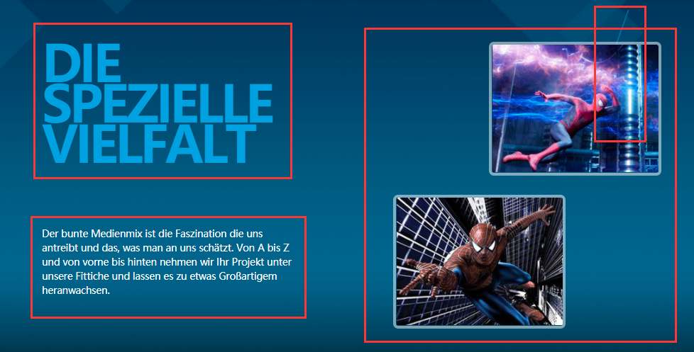

1. 布局

   1. 第四屏主要分为四个部分：about1,about2,about3，about4，参数设置：

      ```
      标题空隙: 上50      右0      下100     左50
      文本   :   宽度400   左侧空隙50
      线背景:   宽度357px 高度:998px
      图片框:   宽度260px 高度200px
              位置偏移: left:750px; top:50px(第一个)
                     left:600px; top:290px(第二个)
              边框:5px rgba(255,255,255,0.5)
              圆角:8px
      ```

   2. about1和about2与之前第二屏、第三屏的第一部分、第二部分都相同

   3. about4是右边的那条线，它是通过设置背景实现的，定位到该位置即可。

   4. about3部分：包含两个区块。

      1. ```
         <div class="about3">
             <div class="item">
               <span></span>
               <ul data-src="img/about1.jpg"></ul>
             </div>
             <div class="item">
               <span></span>
               <ul data-src="img/about3.jpg"></ul>
             </div>
         </div>
         ```

      2. item1,item2两个区块的大小是确定的，添加了边框、圆角。通过定位确定两个块的位置。

      3. 动画的实现：每个块中实际上是放置了两个块span和ul。**实现的原理**：

         1. 首先两个块需要叠起来，所以需要开启定位，开启绝对定位的元素的宽高由内容撑开，所以需要将其宽高修改为item1,item2的宽高。

            ```
            开启定位的元素设定与父元素相同的宽高
            position: absolute;
            left: 0;
            top: 0;
            bottom: 0;
            right: 0;
            ```

         2. 由于开启了绝对定位，所以ul中的元素会直接覆盖掉当前的span中的元素。

         3. span中(也可以是div)放入一个背景图片，并且将其放大了1.5倍，注意需要给外部容器item1,item2添加`overflow:hidden`属性

         4. 在块ul中通过js手动引入了4个li,每个li中放置了一张图片，图片的src指向同一张图片。这个图片就是界面刚加载出来可以看到的那张。通过调整四张图片的摆放位置，使得四张图片看起来像是一张图片

         5. 当鼠标进入ul时:

            1. div2中的图片需要移出div2,则需要调整每张图片的偏移量使其从li中移出。**注意：移动时始终沿着四张图片的中心点移动(img2向左移动，img0向下移动，img2向右移动，img3向上移动，形成一个圆圈)**。另外，为了使得一旦四张图片分别从li中移出，就直接显示出被它们覆盖的img，则需要为每一个li添加`overflow:hidden`属性。这需要通过js设置。另外，需要给每个li中的图片的top或者left属性设置过渡效果。
            2. 将div1的尺寸修改正常，并且添加过渡效果。

            

         6. 当鼠标离开ul时，则需要将四个li中图片归回原位置。

         7. 这部分的代码可以通过js实现，遍历4次，为每个ul添加四个li，li中放置图片，调整每张图片在li中的top和right,使其看起来像是一张图片；当鼠标进入该ul时，调整每张图片的某个属性使其离开li;当鼠标离开li时，则将进入时修改的属性修改回进入前的状态。

### 2.7 第五屏

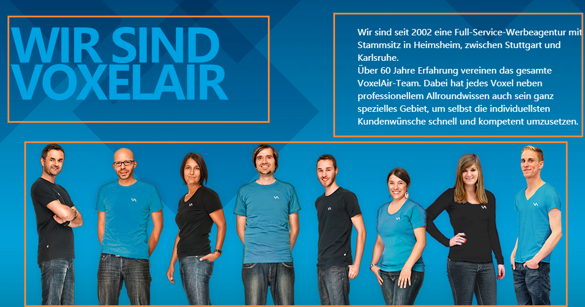

1. 布局

   1. 这部分主要包含三个块。team1,team2,team3

   2. team1就是commonTitle样式，调位置

      1. ```
         外边距：上下左右50 
         宽度,400
         ```

   3. team2就是commonText样式，但是可以看到这段文字包含两段，所以考虑将其放在两个p标签中。另外，team1和team2分别向左右两个方向浮动

      1. ```
         外边距：上下左右50 
         宽度,400
         ```

   4. team3：

      1. 参数：宽度:944 高度 448

      2. team3选择绝对定位，其中包含8个li,使用雪碧图作为每个li的背景，通过调整background-position来确定每个背景的位置。team3的参数如下：

         1. ```
            宽度:944 高度 448
            ```

2.  js交互

   1. 鼠标进入某个li时将其他li的透明度修改为0.5，记得在css中添加过渡效果。

   2. 动画效果：使用canvas

      1. 首先考虑canvas位于页面的结构：直接将canvas放在section下，采取绝对定位。调整canvas的left和top。canvas是相对于team定位的。
      2. canvas的大小：当把鼠标放在某个li上时，会产生一个canvas结构，覆盖li所在的位置，所以canvas的大小等于li的宽高(也可以设置为li宽度的一半)。注意：在createBubbule函数中保存一个变量oc,用于保存创建的canvas。
      3. canvas的位置调整：canvas相对于team定位，而li是相对于team3定位，team3的宽度不等于team,所以只能使用li相对于视口的宽度减去teamS(teamS和team宽度相同)相对于视口的宽度，从而canvas就能完全覆盖住对应的li
      4. 当鼠标从oc移开时，需要将所有li的透明度全部修改为1。另外还要把canvas从section中去除，这样就可以去除气泡效果。注意：除了将canvas从html结构中去除外，还需要清除oc变量。另外，产生运动气泡中也产生了两个延时器，需要将其关闭。

   3. 在这一块，我出现了一个问题，我在**addCanvas**函数中调用**removeCanvas**函数的时候，给它传递了一个参数oc。removeCanvas中将oc作为形参，相当于在oc中新建了一个变量oc,将传递过来的实参作为oc的值。oc属于removeCanvas函数作用域，所以oc=null只会清除它自己作用域中的oc变量。因此当从canvas中移出，再次进入时，会发现全局变量中依然存在canvas,从而不会重新创建canvas,导致canvas不能被插入到section中，从而看不到气泡效果。

      ```
      function addCanvas(){
      	oc
      	...
      	removeCanvas(oc);
      }
      function removeCanvas(oc){
      	oc=null;
      }
      
      ```

   4. 代码：

      ```
       // 第五屏
      var oc = null; // canvas画布
      createBubble();
      function createBubble() {
        // 保存产生运动气泡时的延时器
        let timer1, timer2;
        for (let i = 0; i < team3LiNodes.length; i++) {
          team3LiNodes[i].onmouseenter = function (e) {
            e = e || event;
            for (let i = 0; i < team3LiNodes.length; i++) {
              team3LiNodes[i].style.opacity = "0.5";
            }
            team3LiNodes[i].style.opacity = "1";
            addCanvas();
            oc.style.left =
              this.getBoundingClientRect().left -
              teamS.getBoundingClientRect().left +
              "px";
            bubble();
          };
        }
      
        // 在页面中添加canvas结构
        function addCanvas() {
          if (!oc) {
            oc = document.createElement("canvas");
            teamS.appendChild(oc);
            oc.width = team3LiNodes[0].offsetWidth;
            oc.height = (team3LiNodes[0].offsetHeight * 2) / 3;
            // oc.style.backgroundColor = "red";
      
            // 当鼠标从ul中出去时，将所有的opacity恢复为1
            // 鼠标移入li,触发enter事件，产生canvas,canvas覆盖了li,使得鼠标离开了li，触发了leave事件，将所有的opacity全部设置为了1
            oc.onmouseleave = function () {
              for (let i = 0; i < team3LiNodes.length; i++) {
                team3LiNodes[i].style.opacity = "1";
              }
              removeCanvas();
              // 注意这里不能用函数进行，因为会产生闭包
              // 因为这个函数中调用了外部函数中的变量oc,所以在removeCanvas中产生了闭包，在该函数中清除只会清除掉闭包中的oc
              // 全局变量中的oc不会受到影响
              // oc.remove();
              // oc = null;
              // clearInterval(timer1);
              // clearInterval(timer2);
              // console.log("我清除了", oc);
            };
          }
        }
        
        // 移除canvas  
        function removeCanvas() {
          // 从html结构中清除canvas
          oc.remove();
          // 清除oc变量
          oc = null;
          // 清除产生气泡效果的延时器
          clearInterval(timer1);
          clearInterval(timer2);
        }
      
        // 产生气泡效果
        function bubble() {
          if (oc.getContext) {
            var ctx = oc.getContext("2d");
      
            // 保存圆的信息
            var arr = [];
            timer1 = setInterval(function () {
              // console.log(arr);
              var x = Math.random() * oc.width; // 圆心
              var r = Math.random() * 6 + 2;
              var y = oc.height - r; // 圆的半径
              var red = Math.random() * 255; // 控制圆的颜色
              var green = Math.random() * 255;
              var blue = Math.random() * 255;
              var alpa = 1; // 控制圆的透明度
      
              var deg = 0; //控制sin函数的角度变化，即圆的高度移动
              var startX = x; // 控制圆的运动圆心位置
              var startY = y;
              var step = Math.random() * 10 + 10; // 控制曲线的运动形式
              arr.push({
                x,
                y,
                r,
                red,
                green,
                blue,
                alpa,
                deg,
                startX,
                startY,
                step,
              });
            }, 50); // 每50ms就产生一个随机圆
      
            // 每60s检测一次，
            timer2 = setInterval(function () {
              //   清除上一次的画布
              ctx.clearRect(0, 0, oc.width, oc.height);
      
              // 添加圆的曲线运动
              for (let i = 0; i < arr.length; i++) {
                arr[i].deg += 10; // 增大度数的变化速度
                // 控制圆心的运动位置
                arr[i].x =
                  arr[i].startX +
                  Math.sin((arr[i].deg * Math.PI) / 180) * arr[i].step * 2;
      
                // 这里要减：这样气泡才会往上跑
                arr[i].y =
                  arr[i].startY -
                  ((arr[i].deg * Math.PI) / 180) * arr[i].step;
      
                // 如果气泡到了距离顶部50处，则从数组中清除掉，控制arr中元素的数量
                if (arr[i].y <= 50) {
                  arr.splice(i, 1);
                }
              }
      
              //   将数组中的圆绘制到画布上
              arr.forEach((item) => {
                // console.log("我在画呢");
                // 画圆
                ctx.save();
                ctx.fillStyle = `rgba(${item.red}, ${item.green}, ${item.blue}, ${item.alpa})`;
                ctx.beginPath();
                ctx.arc(item.x, item.y, item.r, 0, (360 * Math.PI) / 180);
                ctx.fill();
                ctx.restore();
              });
            }, 1000 / 60); // 每1000/60ms就画一次圆
          }
        }
      }
      ```

      

### 2.8 dot区域

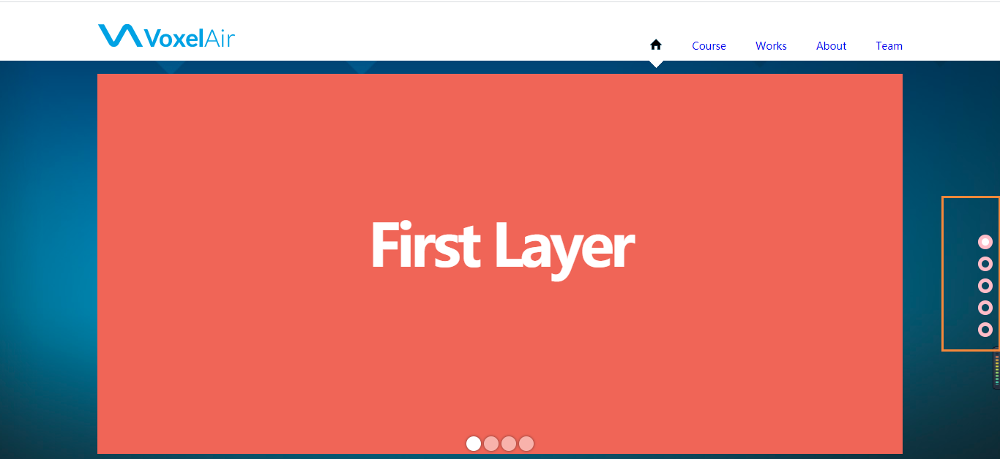

1. 布局：

   1. 可以将其作为与head,content并列的第三个块dot。
   2. 首先它肯定是一个块容器中包了5个li。先确定每个li的大小，设置border-radius,设置边框，每个li的间距。然后将整体块容器设置为fixed布局，固定定位永远参照于视口。

2. js交互：

   1. 可以发现dot的交互和头部导航栏的点击功能、滚动条的滑动切换页面功能都是一个功能。所以直接在头部的headBind函数中为被点击的li添加active类。在move函数中实现具体的功能。

      ```
      function headBind() {
        // 为被点击的li添加单击函数
        for (let i = 0; i < dotLiNodes.length; i++) {
          dotLiNodes[i].onclick = function (event) {
            move(i);
          };
        }
      }
      
      //   这里面的功能后需要还可以用到，所以提取为一个单独的函数
      function move(i) {
        ...
        
        // 将其他的dot li上的active去掉
        for (let i = 0; i < dotLiNodes.length; i++) {
          dotLiNodes[i].classList.remove("active");
        }
        dotLiNodes[i].classList.add("active");
      
        now = i;
      }
      
      在css中添加被选中的样式
      #content > .dot > li.active {
        background-color: #fff;
      }
      ```

### 2.9 出入场动画

1. 每一页都具有出入场动画，

#### 第一页


1. 第一页的出场动画是：第一层上去，第二层出现，下面的小圆点从下至上出现;使用一个数组anArr保存每一页的出入场动画。

2. ```
   {
       inAn: function () {
         // home1，home2回到正常的位置
         home1.style.transform = "translateY(0px)";
         let home2 = document.querySelector("#content>.list>.home .home2");
         home2.style.transform = "translateY(0px)";
         home1.style.opacity = 1;
         home2.style.opacity = 1;
       },
       outAn: function () {
       // home1下移，home2上移
         home1.style.transform = "translateY(-200px)";
         let home2 = document.querySelector("#content>.list>.home .home2");
         home2.style.transform = "translateY(100px)";
         home1.style.opacity = 0;
         home2.style.opacity = 0;
       },
     },
   ```

#### 第二页

1. 进入三个小飞机，直接在section下添加三个div块，背景图为小飞机。通过绝对定位方式定位三个小飞机的位置，然后由于小飞机是后面加入的html结构的，所以会将section中的其它元素盖住，所以需要为其它元素调整z-index,**但是要注意：只有开启定位的元素才可以调整z-index**,所以需要为course1,course2添加相对定位，将它们三个的z-index统一调整为2。

2. 设定入场前的位置和入场后的位置：

   ```
   {
       inAn: function () {
         // 三个小飞机回到最初的位置
         let plane1 = document.querySelector(
           "#content > .list > .course .plane1"
         );
         let plane2 = document.querySelector(
           "#content > .list > .course .plane2"
         );
         let plane3 = document.querySelector(
           "#content > .list > .course .plane3"
         );
         plane1.style.transform = "translate(0px, 0px)";
         plane2.style.transform = "translate(0px, 0px)";
         plane3.style.transform = "translate(0px, 0px)";
       },
       outAn: function () {
         // 三个小飞机进行一定的偏移
         let plane1 = document.querySelector(
           "#content > .list > .course .plane1"
         );
         let plane2 = document.querySelector(
           "#content > .list > .course .plane2"
         );
         let plane3 = document.querySelector(
           "#content > .list > .course .plane3"
         );
         plane1.style.transform = "translate(-200px, -200px)";
         plane2.style.transform = "translate(-200px, 200px)";
         plane3.style.transform = "translate(200px, -200px)";
       },
   },
   
   /* 第二屏：三架飞机 */
   #content > .list > .course .plane1 {
     width: 359px;
     height: 283px;
     background: url(img/plane1.png) no-repeat;
     position: absolute;
     transition: 1s transform;
     left: 350px;
     top: -100px;
     transform: scale(0.8);
   }
   #content > .list > .course .plane2 {
     width: 309px;
     height: 249px;
     background: url(img/plane2.png) no-repeat;
     position: absolute;
     transition: 1s transform;
     left: -100px;
     top: 200px;
     transform: scale(0.8);
   }
   #content > .list > .course .plane3 {
     width: 230px;
     height: 182px;
     background: url(img/plane3.png) no-repeat;
     position: absolute;
     transition: 1s transform;
     left: 250px;
     bottom: -50px;
   }
   /* 隐藏小飞机溢出部分 */
   #content > .list > .course section {
     overflow: hidden;
   }
   ```

#### 第三页

1. 进入三支铅笔，直接在section下添加三个div块，背景图为铅笔。通过绝对定位方式定位铅笔的位置，然后由于铅笔是后面加入的html结构的，所以会将section中的其它元素盖住，所以需要为其它元素调整z-index,**但是要注意：只有开启定位的元素才可以调整z-index**,所以需要为works1,works2,works3添加相对定位，将它们三个的z-index统一调整为2。

2. 设定入场前后的位置：

   ```
   {
       inAn: function () {
         let pencel1 = document.querySelector(
           "#content > .list > .works .pencel1"
         );
         let pencel2 = document.querySelector(
           "#content > .list > .works .pencel2"
         );
         let pencel3 = document.querySelector(
           "#content > .list > .works .pencel3"
         );
   
         pencel1.style.transform = "translateY(0px)";
         pencel2.style.transform = "translateY(0px)";
         pencel3.style.transform = "translateY(0px)";
       },
       outAn: function () {
         let pencel1 = document.querySelector(
           "#content > .list > .works .pencel1"
         );
         let pencel2 = document.querySelector(
           "#content > .list > .works .pencel2"
         );
         let pencel3 = document.querySelector(
           "#content > .list > .works .pencel3"
         );
         pencel1.style.transform = "translateY(-100px)";
         pencel2.style.transform = "translateY(100px)";
         pencel3.style.transform = "translateY(100px)";
       },
     },
     
     
   /* 第三屏 */
   #content > .list > .works section {
     overflow: hidden;
   }
   
   #content > .list > .works .pencel1 {
     width: 180px;
     height: 97px;
     background: url(img/pencel1.png) no-repeat;
     position: absolute;
     transition: 1s;
     left: 500px;
     top: 0;
   }
   #content > .list > .works .pencel2 {
     width: 268px;
     height: 38px;
     background: url(img/pencel2.png) no-repeat;
     position: absolute;
     transition: 1s;
     left: 300px;
     top: 250px;
   }
   #content > .list > .works .pencel3 {
     width: 441px;
     height: 231px;
     background: url(img/pencel3.png) no-repeat;
     position: absolute;
     transition: 1s;
     left: 650px;
     top: 300px;
   }
   ```

#### 第四页

1. 两个块的旋转，直接获得两个块，然后添加transform属性即可。

2. 旋转前后角度设置：

   ```
   {
       inAn: function () {
         // 进入时，三个块从旋转的位置回到未旋转的状态
         let about31 = document.querySelector(
           "#content > .list > .about .about3>.item:nth-of-type(1)"
         );
         let about32 = document.querySelector(
           "#content > .list > .about .about3>.item:nth-of-type(2)"
         );
         about31.style.transform = "rotateZ(0deg)";
         about32.style.transform = "rotateZ(0deg)";
       },
       outAn: function () {
         // 切换到别的界面时，两个块从未旋转的状态切换到旋转后的状态
         let about31 = document.querySelector(
           "#content > .list > .about .about3>.item:nth-of-type(1)"
         );
         let about32 = document.querySelector(
           "#content > .list > .about .about3>.item:nth-of-type(2)"
         );
         about31.style.transform = "rotateZ(30deg)";
         about32.style.transform = "rotateZ(-30deg)";
       },
     },
     
   #content > .list > .about .about3 > .item {
     transition: transform 1s;
   }
   
   #content > .list > .about section {
     overflow: hidden;
   }
   ```

#### 第五页

1. team1和team2分别从两边进入画面，直接调整transformX值即可

2. ```
   {
       inAn: function () {
         let team1 = document.querySelector(
           "#content >.list >.team team1"
         );
         let team2 = document.querySelector(
           "#content >.list >.team team2"
         );
         team1.style.transform = 0;
         team2.style.transform = 0;
       },
       outAn: function () {
         let team1 = document.querySelector(
           "#content >.list >.team team1"
         );
         let team2 = document.querySelector(
           "#content >.list >.team team2"
         );
         team1.style.transform = "translateX(-200px)";
         team2.style.transform = "translateX(200px)";
       },
     },
     
   /* 第五屏 */
   #content > .list > .team .team1,
   #content > .list > .team .team2 {
     transition: transform 1s;
   }
   
   #content > .list > .team section {
     overflow: hidden;
   }
   ```

#### 将动画与其他操作结合

1. 首先确定出入场动画切换有3种方式：点击导航栏、滚动条切换、右侧小圆点切换。

2. 需要新建一个变量保存前一个页面的索引。公共变量：preI

   1. 在滚动条切换的函数fn中：switch负责根据滚动的方向得到即将到达的新的界面索引。所以在switch之前就可以先将当前界面的索引赋值给preI，因为switch中会调用move,从而直接转到新的索引页面

      ```
      function fn(e) {
        ...
        
        // 当前页码
        preI = now;
      
        switch (direction) {
          ...
        }
      }
      ```

   2. 在点击导航栏 和 点击右侧小圆点切换页面的函数 headBind中: now保存着当前未点击之前的页面的索引，将其赋值给preI

      ```
      function headBind() {
      	...
      
        // 点击每一个nav，箭头就移动到对应li的正下方，并且该li的up展示
        for (let i = 0; i < liNodes.length; i++) {
          liNodes[i].onclick = function (event) {
            // now是当前正显示的页面的索引，i是正要点击的页面的索引
            preI = now;
            move(i);
          };
        }
        for (let i = 0; i < dotLiNodes.length; i++) {
          dotLiNodes[i].onclick = function (event) {
            preI = now;
            move(i);
          };
        }
      }
      ```

3. 在move函数中，i保存着即将去到的页面的索引，preI保存着当前未点击(或滚动)之前页面的索引，所以加入开启动画的代码：

   ```
   function move(i) {
     ...
   
     // 入场动画
     if (anArr[i] && typeof anArr[i]["inAn"] === "function") {
       anArr[i].inAn();
     }
     // 出场动画
     if (anArr[preI] && typeof anArr[preI]["outAn"] === "function") {
       anArr[preI].outAn();
     }
   
     now = i;
   }
   ```

4. 直接先将除了第一页之外的其余页面进入出场动画的状态，因为第一页是页面刚加载时就回展示的，展示入场时的状态即可

       ```
       for (let i = 1; i < anArr.length; i++) {
       	anArr[i].outAn();
       }
       ```

### 2.10 音频

1. 布局：在头部headMain中添加一个块区域，其中放置一个audio标签,通过css设置div的大小和背景、位置

   ```
   <div class="music">
   	<audio src="./img/audio.mp3" loop autoplay></audio>
   </div>
   
   /* 音频start */
   #head > .headMain > .music {
     width: 14px;
     height: 14px;
     background: url(./img/musicoff.gif);
     position: absolute;
     bottom: 20px;
     left: 190px;
     cursor: pointer;
   }
   
   /* 音频end */
   ```

2. js控制audio的播放和暂停、以及div块背景的切换

   ```
   // 音频
   let music = document.querySelector("#head > .headMain > .music");
   let audio = document.querySelector(
     "#head > .headMain > .music > audio"
   );
   // console.log(music);
   music.onclick = function () {
     if (audio.paused) {
       audio.play();
       music.style.background = "url(./img/musicon.gif)";
     } else {
       audio.pause();
       music.style.background = "url(./img/musicoff.gif)";
     }
   };
   ```

3. 目前的浏览器都不支持页面加载后就直接自动播放，均需要点击才可以播放。

### 2.11 开机动画

1. 布局

   1. 开机动画实际上是在wrap下放置一个div块mask,mask中存在三个div块:up,down,line，两个div块up和down分别占据屏幕的一般，另外一个div块line是一条线。由于后面在做过渡的时候，up块的从下到上缩减高度为0，所以它的高度参照线就应该是上边，直接用top定位即可。down块是从上到下缩减高度为0的，所它的高度参照线就是下边沿，需要使用bottom定位。

   2. line直接定位在界面中心处即可

   3. ```
      <div id="mask">
          <div class="up"></div>
          <div class="down"></div>
          <div class="line"></div>
      </div>
      
      /* 开机动画 start */
      html,
      body,
      #wrap {
        height: 100%;
      }
      #mask > .up {
        width: 100%;
        height: 50%;
        background-color: deepskyblue;
        position: absolute;
        z-index: 100;
        transition: 2s height;
      }
      #mask > .down {
        width: 100%;
        height: 50%;
        background-color: deepskyblue;
        position: absolute;
        z-index: 100;
        transition: 2s height;
        /* 这里要用right和bottom实现定位，这样高度的参考点就变成了下边线
        高度在减小为0时就是沿着上边->下边
        */
        right: 0;
        bottom: 0;
      }
      #mask .line {
        height: 4px;
        width: 0;
        position: absolute;
        left: 0;
        top: 50%;
        margin-top: -2px;
        background-color: #fff;
        z-index: 101;
        transition: 2s width;
      }
      /* 开机动画 end */
      ```

   4. js交互

      1. 放置一个图片数组，js控制线条的宽度显示图片加载的进度，并且为宽度的变化添加过渡效果transition
      2. 当线条的过渡效果执行完毕，则将三个div块的高度分别设置为0，并且为其添加过渡效果
      3. 当三个div块的过渡效果执行完毕，则需要将mask从html结构中清除，因为它已经没啥用了。

      ```
      // 开机动画
      let flag = 0;
      let line = document.querySelector("#mask .line");
      let areas = document.querySelectorAll("#mask div");
      let mask = document.querySelectorAll("#mask");
      
      loadingAnimation();
      function loadingAnimation() {
        var arr = [
          "bg1.jpg",
          "bg2.jpg",
          "bg3.jpg",
          "bg4.jpg",
          "bg5.jpg",
          "about1.jpg",
          "about2.jpg",
          "about3.jpg",
          "about4.jpg",
          "worksimg1.jpg",
          "worksimg2.jpg",
          "worksimg3.jpg",
          "worksimg4.jpg",
          "team.png",
          "greenLine.png",
        ];
        for (let i = 0; i < arr.length; i++) {
          var img = new Image();
          img.src = "img/" + arr[i];
          img.onload = function () {
            flag++;
            line.style.width = (flag / arr.length) * 100 + "%";
          };
        }
        line.addEventListener("transitionend", function () {
          if (flag === arr.length) {
            for (let i = 0; i < areas.length; i++) {
              areas[i].style.height = 0 + "px";
            }
            this.style.display = "none";
          }
        });
      
        // 在任意一个area[i]的动画结束的时候，删除mask结构
        areas[0].addEventListener("transitionend", function () {
          mask.remove();
        });
      }
      ```

### 2.12 鼠标事件的冒泡

1. onmouseenter onmouseleave事件不存在事件的冒泡
2. mouseover,mouseout会产生冒泡，冒泡：执行子事件->执行父元素相同事件->执行祖父元素相同事件。元素在其子元素上时，也会冒泡执行。
3. 元素层级很多的时候，不要用mouseover,mouseout

